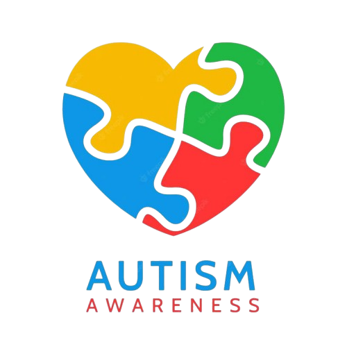

# 🧩 Autism Screening AI Tool



An intelligent, accessible, and supportive web application designed to help parents and caregivers assess the early signs of Autism Spectrum Disorder (ASD) in children. The tool uses a machine-learning model based on a clinically informed questionnaire to predict the probability of ASD and provide actionable next steps.

**Note:** *This is a screening tool for supportive guidance only and is not a medical diagnosis. Always consult with a qualified healthcare professional.*

## ✨ Features

- **📋 Easy-to-use Screening Questionnaire**: Answer 10 simple questions about your child's behavior (based on the AQ-10), along with demographic and medical history information.
- **📊 Real-time AI Predictions**: Get immediate, personalized results and risk level assessments.
- **🤖 Machine Learning Powered**: Uses a robust **Gaussian Naive Bayes Classifier** trained with Semi-Supervised Self-Training for high accuracy (approx. 91.3% cross-validation score).
- **💡 Actionable Guidance**: Provides clear, compassionate next steps and resources tailored to the predicted risk level.
- **🔒 Privacy First**: Your responses are temporary and are not stored permanently.
- **📱 Beautiful & Responsive UI**: Built with Streamlit, featuring a calming green theme and intuitive navigation.

## 🛠️ Technology Stack

- **Frontend & Backend**: [Streamlit](https://streamlit.io/)
- **Machine Learning**: Scikit-Learn (Gaussian Naive Bayes)
- **Data Manipulation**: Pandas, NumPy
- **Visualizations**: Plotly
- **Model Serialization**: Pickle

## 📁 Project Structure

```
Autism_prediction_ai_tool/
├── app.py                     # Main Streamlit application and navigation
├── pages/                     # Streamlit multi-page structure
│   ├── 1_Home.py              # Landing page and quick start guide
│   ├── 2_Screening.py         # The screening questionnaire form
│   ├── 3_Results.py           # Displays prediction results and recommendations
│   ├── 4_About.py             # Details about the ML model, data, and methodology
│   └── 5_Learning.py          # Educational resources about autism
├── core/                      # Core backend logic
│   ├── predictor.py           # Loads the model and handles prediction logic
│   └── utils.py               # Helper functions (report generation, etc.)
├── models/                    # Saved models and training scripts
│   ├── autism_model.pkl       # Serialized trained model (generated after training)
│   ├── column_info.pkl        # Feature columns information
│   └── train_model.py         # Script to train the Naive Bayes model
├── data/                      # Datasets and resources
│   ├── Child-Data2017.csv     # Training data
│   ├── Child-Data2018.csv     # Training data
│   └── resources.json         # Helpful links and resources based on probability
├── assets/                    # Images and static assets
└── requirements.txt           # Python dependencies
```

## 🚀 How to Run Locally

### 1. Clone the repository
```bash
git clone https://github.com/somiaamari/Autism_prediction_ai_tool.git
cd Autism_prediction_ai_tool
```

### 2. Install dependencies
It is recommended to use a virtual environment.
```bash
pip install -r requirements.txt
```

### 3. Train the model (if necessary)
If the pre-trained model `autism_model.pkl` is not present in the `models/` directory, you can generate it by running:
```bash
python models/train_model.py
```

### 4. Run the Streamlit app
```bash
streamlit run app.py
```

The app will open in your default web browser at `http://localhost:8501`.

## 🧠 Model Architecture

The tool uses a **Gaussian Naive Bayes Classifier** trained with a **Semi-Supervised Self-Training Approach**. 
- **Data**: Trained on clinical datasets featuring labeled (161 samples) and unlabeled (636 samples) data.
- **Top Predictive Features**: 
  - Social Interaction (A1-A4) - 85% importance
  - Communication Patterns (A5-A7) - 78% importance
  - Behavioral Patterns (A8-A10) - 72% importance
  - Family History - 65% importance


## ⚠️ Disclaimer

This educational content is for informational purposes only and should not replace professional medical advice. Always consult with qualified healthcare providers for diagnosis and treatment decisions.
